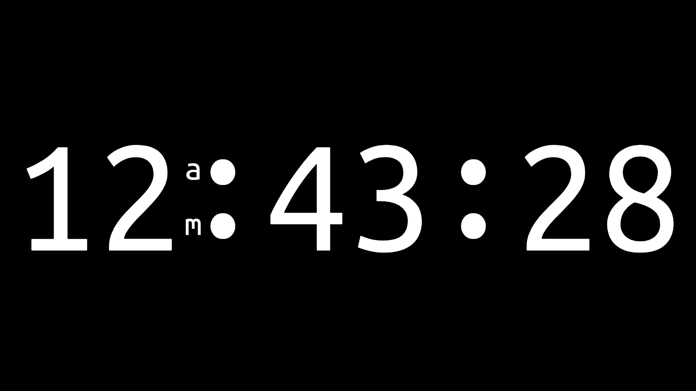
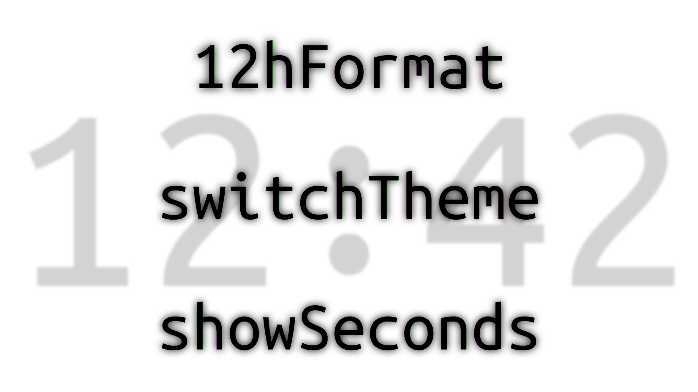

## About The Project

### "fsdclock" is a fully responsive browser based "full screen digital clock"

### You have 3 options in the menu to change the appearance and functionality of it

* 12h/24h format
* switch between two themes of your choice (light and dark by default)
* hide/show seconds

(<a href="#top">back to top</a>)

### Built With

* HTML
* CSS
* JavaScript

(<a href="#top">back to top</a>)

## Getting Started

### Installation

1. To try it out click on one image above or visit fsdclock.w3bdev.de

2. To use it locally and make some adjustments, download it from fsdclock.w3bdev.de/download/fsdclock.zip

(<a href="#top">back to top</a>)

### Usage

1. Unpack `fsdclock.zip` and open `fsdclock.html` which must remain in the original folder

2. Or use the `StandaloneVersionWithSystemFont.html` where the entire app is in this one file and the system font is used

3. Set your own theme in the `color-config.css` or in the standalone version in line 10-20

(<a href="#top">back to top</a>)

## License

Distributed under the MIT License. See `LICENSE.txt` for more information.

(<a href="#top">back to top</a>)

## Contact

Sergej Maisinger - [LinkedIn](https://www.linkedin.com/in/sergejmaisinger/) - [Xing](https://www.xing.com/profile/Sergej_Maisinger/cv) - [Email](mailto:maisinger@w3bdev.de)

Project Link: [https://github.com/msngr/fsdclock](https://github.com/msngr/fsdclock)

(<a href="#top">back to top</a>)
